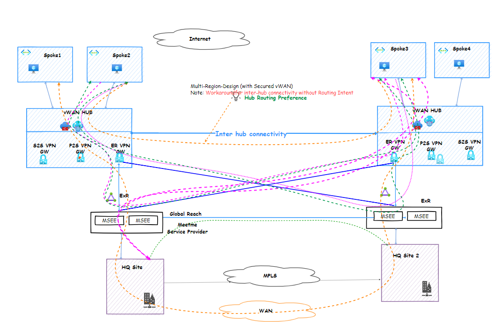

Need module for routing intent---Completed
Usage of import module---terraform plan -generate-config-out=generated.tf
Eg...import {
  to = azurerm_express_route_port.example
  id = "/subscriptions/subscription id/resourceGroups/rg name/providers/Microsoft.Network/expressRoutePorts/port name"
}
For infoblox:
Accept Marketplace Terms: You also need to ensure that the Marketplace terms for Infoblox have been accepted for your subscription.
az vm image terms accept --publisher infoblox --offer infoblox-vm-appliances-901 --plan vgsot

To ignore large files:

git filter-branch -f --index-filter 'git rm --cached -r --ignore-unmatch .terraform/'

For checkpoint
admin
 
passphrase: azure
 
expertmode pass: admin123

HLD for Azure multi region VHUB setup
 
 

